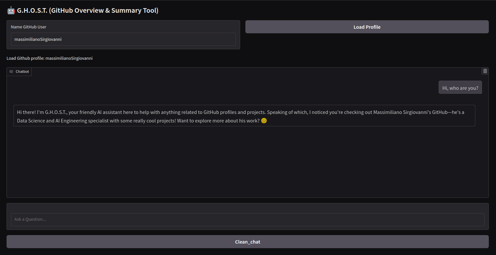
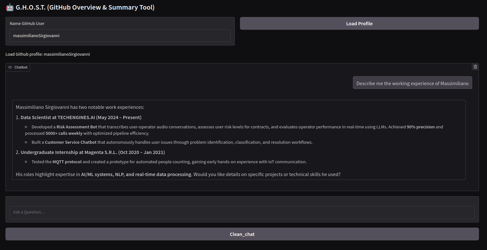
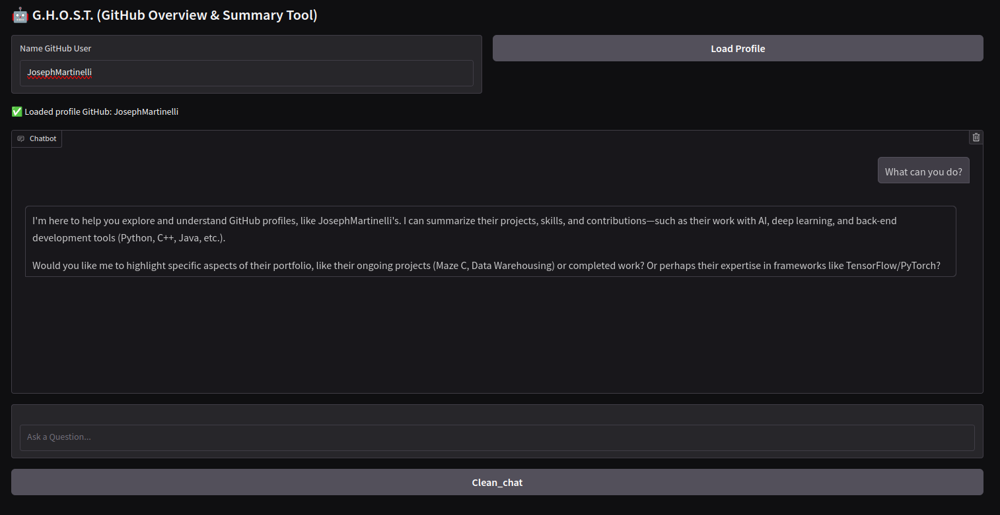

# G.H.O.S.T. (GitHub Overview & Summary Tool)

**G.H.O.S.T.** is a small personal project created to apply some of the knowledge I've gained in the fields of NLP.

The core idea is to build a chatbot capable of **reading a GitHub user's profile page in real-time**, in order to answer questions related to that specific profile.

By default, the chatbot is set to use the GitHub profile of its creator, _massimilianoSirgiovanni_, but you can provide a different GitHub username, and the chatbot will adapt to the requested user.

# Installations and Execute (on Linux)

The version of python used for this project is: ```Python 3.12.2```.

### (Optional) Create a python Enviroment

It is recommended to create a new Python environment, as some libraries need to be installed. The following steps will explain how to create and activate a Python environment using ```venv``` (although you're free to use other tools like Conda if you prefer).

\# Note: For this environment it was chosen to insert it in the venv folder with the name "ghost", obviously this is a parameter that can be changed at will
```commandline
python -m venv venv/ghost
source venv/ghost/bin/activate
```

### Install the Requirements
To install all the necessary libraries and dependencies required to run the code, you simply need to install the packages listed in the requirements.txt file.
```commandline
pip install -r requirements.txt
```

### Execute the code

To quickly clone the repository and launch the application, run the following commands in your terminal:
```commandline
git clone https://github.com/massimilianoSirgiovanni/GitHub_Overview_Summary_Tool.git
```

Navigate into the project directory and launch the application:
```commandline
cd GitHub_Overview_Summary_Tool
python main.py
```

# Usage and Examples

The goal is to create a chatbot that, given a GitHub profile as input, can analyze and describe it in detail, answering any questions the user might ask about it.

Naturally, the more complete and detailed the GitHub profile is, the more accurate and insightful the chatbot's responses will be.

Below are some example images showcasing how the chatbot works in practice.

### Example 1
</img>

G.H.O.S.T. introduces itself by mimicking the behavior of a friendly human, explaining its purpose in a conversational way.
Without being too pushy, it smoothly transitions to talking about the GitHub profile it has been given as input—by default, its creator's profile—offering a brief overview and inviting the user to ask for more specific information.

### Example 2
</img>
G.H.O.S.T. can dive into the details of a GitHub profile, summarizing its content and providing clearer explanations of what it contains.

### Example 3
</img>
Additionally, you can provide G.H.O.S.T. with a different GitHub profile, in the text area at the top of the image, and it will work seamlessly without the need to redefine or adjust the prompts.

# Project Structure

This is a small project. The code is located in the main directory.

The core file is ```main.py```, which also serves as the entry point for execution. It initializes the graphical interface using Gradio, enabling interaction with the chatbot, and connects the front-end interface to the back-end logic.

The ```model_function.py``` file contains all the functions responsible for running the chatbot, as well as formatting its input and output properly.

The ```reading_page.py``` file, on the other hand, includes all the methods used to extract the desired GitHub profile and perform any related pre-processing tasks.

The ```logger.py``` file provides utility functions for creating and managing the log file.

Due to the lack of suitable hardware capable of running even small-scale LLMs locally, the decision was made to use OpenRouter for model access.

For demonstration purposes, DeepSeek was chosen because of its efficiency and relatively low cost.
However, other models such as Gemini, Mistral, or GPT can also be used as alternatives.

To use OpenRouter, you need an API key, which must be placed inside the following file:
```./secret/open_router_key.txt```

# Possible Future Extensions

At the moment, the chatbot works by taking a GitHub user's main profile page as input. This is because the project is meant to be a simple proof of concept, demonstrating how LLMs and RAG can be applied in practice.

In the future, the project could be expanded to allow the chatbot to navigate through a user's GitHub profile, potentially analyzing and describing the code within public repositories.

Another possible extension could be to generalize the functionality, allowing the chatbot to process and interact with any public web page, not just GitHub profiles.
